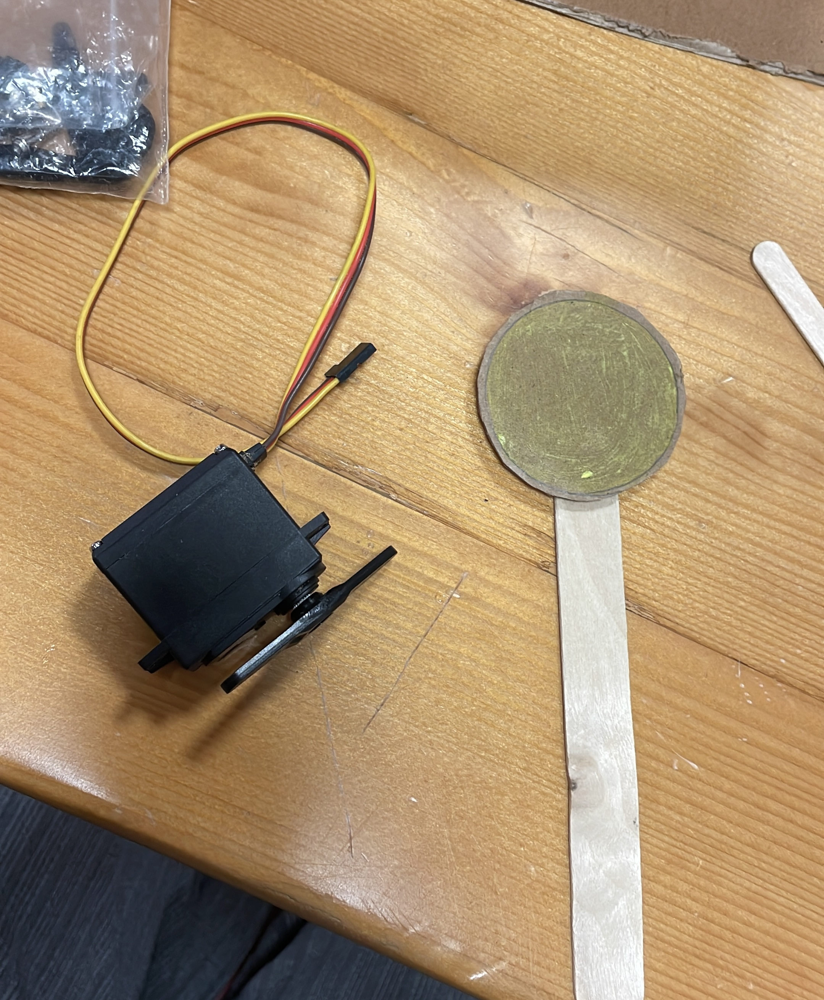

For the prototype, we worked with Shreya together since we're in the same group! Please check with her repo for more videos and docu.

Aside from our work on the waves, I have glued together the Sun piece from the cardboard and the servo motor. The plan is to make the Sun move in semi-circles:

Please follow this link for the documentation: https://github.com/shreya81601/MachineLab/tree/main/27March

The PDF of the paper is available in the repo.

Presentation [work in progress]: https://docs.google.com/presentation/d/1iSANciC31Y-W_dNk0CWZ5T7R71RUo9mkAvH_mt2t46U/edit?usp=sharing 
