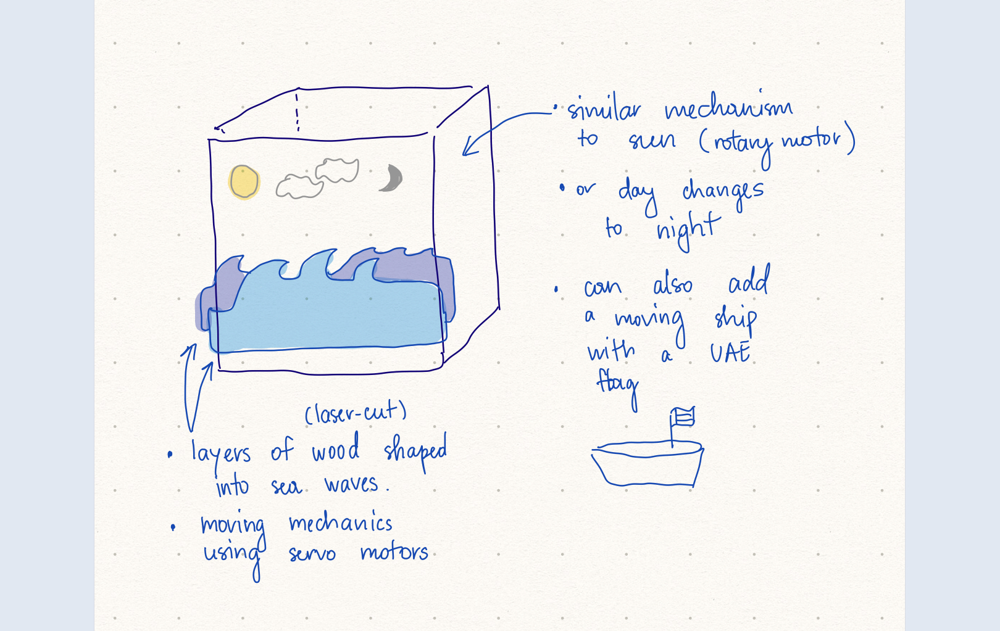

# First Draft of the Project

## UAE Gulf: Day and Night

Essential parts/wooden cutouts:
- waves (3 pieces),
- the Sun,
- the Moon,
- the clouds,
- the ship with a flag

All of the parts will be laser-cut from a thin piece of wood and can be painted to necessary colors.

The movement will facilitated with servo/rotary motors. The most difficult part will be moving the waves and alternating between day/night, if we choose to go in this direction. The Sun and the Moon can be a part of the Neopixel board, then it becomes easier to alternate between states. This can also be dependent on the actual clock time.
